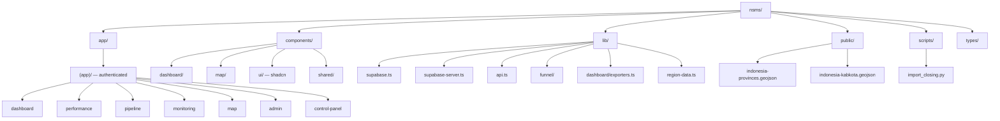
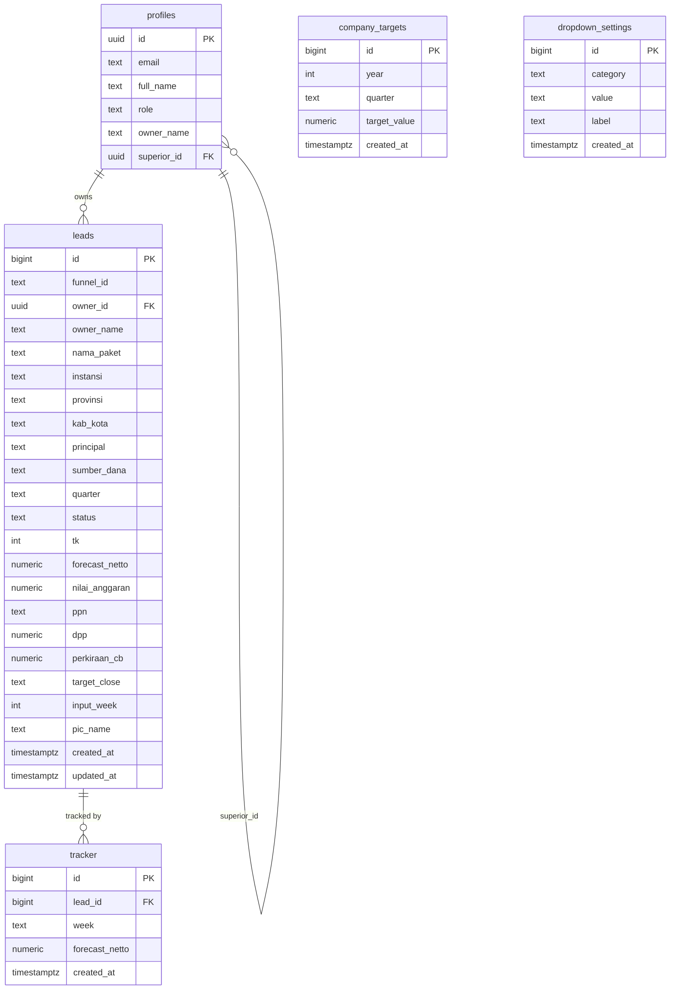

# 🇮🇩 NSMS — National Sales Management System

Internal sales pipeline management tool milik **PT Piwulang Pradnya Luhur (Intan Pariwara)**.

🔗 **Live:** [nsms-three.vercel.app](https://nsms-three.vercel.app)

**Stack:** Next.js 16 (App Router) · TypeScript · Tailwind CSS · Shadcn UI · Supabase (PostgreSQL + RLS) · Recharts · Leaflet · ExcelJS

---

## 👥 Role & Akses

| Role | Akses Halaman | Keterangan |
|---|---|---|
| `superadmin` | Semua halaman | Akses penuh, bisa override lead terkunci |
| `admin` | Dashboard, Monitoring, Admin Panel, Control Panel | Manajemen data & user |
| `sales` | Pipeline, Map (scoped) | Hanya lihat & kelola leads miliknya |
| `am` | Personal pipeline | Account Manager |
| `mp` | Branch/personal view, Map (scoped) | Hanya lihat leads miliknya |
| `sp` | Team view | Supervisor |
| `dirut` | Sama seperti MP | Direktur Utama |
| `guest` | Dashboard read-only | Akses terbatas, tanpa edit |

---

## 📁 Directory Structure



---

## 🗄️ Database Schema



---

## 📐 Business Rules

> **BR-1 — Snapshot forecast_netto**
> `forecast_netto` di tabel `tracker` adalah **auto-snapshot** dari `leads.forecast_netto` saat submit.
> `UpdateForm.tsx` **TIDAK BOLEH** memiliki field input `forecast_netto` manual.

> **BR-2 — Lead terkunci**
> Lead **terkunci** jika `tk === 100` (Closing) atau `tk === 0` (Gagal).
> Hanya `admin` / `superadmin` yang bisa override via **Control Panel Tab 3**.

---

## 🔑 Funnel ID System

Format: **`{PREFIX}-{XXXX}`** — sequential per PIC (4 digit zero-padded).

- **Lokasi:** `lib/funnel/prefixMap.ts` + `generateFunnelId()`
- **Prefix collision:** jika dua PIC menghasilkan prefix yang sama, gunakan **4 huruf**.
  Contoh: `ACH` → `ACHA` (Achmad Angsorudin) / `ACHS` (Achmad Suharyadi)

---

## 📄 Key Pages

| Halaman | Route | Akses Role | Deskripsi |
|---|---|---|---|
| Dashboard | `/dashboard` | semua (guest read-only) | KPI, charts, ringkasan pipeline |
| Performance | `/performance` | superadmin, admin, mp, sp, dirut, am | Analisis performa sales |
| Pipeline | `/pipeline` | sales, am | Input & update leads |
| Monitoring | `/monitoring` | superadmin, admin | Pantau tracker mingguan |
| Map | `/map` | superadmin, admin, mp, sp, dirut, am, sales | Peta sebaran leads (provinsi & kab/kota) |
| Admin Panel | `/admin` | superadmin, admin | Manajemen leads & user |
| Control Panel | `/control-panel` | superadmin, admin | Override lead terkunci, settings |

---

## 🎨 Design System

| Token | Value |
|---|---|
| Page background | `#F5F5F2` |
| Card background | `#FFFFFF` |
| Border | `#EBEBE7` (0.5px) |
| Text primary | `#1A1A18` |
| Text muted | `#6B6B65` |
| Emerald brand | `#064E3B` |
| Font body | DM Sans (300 / 400 / 500) |
| Font mono | DM Mono — **HANYA** untuk funnel ID & week label |
| Border radius | 8px cards · 14px hero cards · 100px pills |

---

## ⚙️ Technical Notes

Penting untuk developer baru:

- **Supabase browser client:** `import { supabase } from '@/lib/supabase'`
- **Supabase server client:** `createClient()` dari `@/lib/supabase-server`
- **RLS:** `get_my_role()` = security definer function untuk RLS (hindari recursive policy)
- **Dialog lebar:** pakai inline style `min(Xpx, 95vw)` — jangan className Tailwind `!important`
- **Week format:** `W{N}-YYYY` tanpa leading zero (`W1-2026`, bukan `W01-2026`)
- **Quarter → Week mapping:** Q1 = W1–13 · Q2 = W14–26 · Q3 = W27–39 · Q4 = W40–52
- **PowerShell:** gunakan semicolons (`;`) sebagai command separator
- **Export Excel:** gunakan `exceljs` (**bukan** `xlsx` — ada high severity vulnerability)
- **Map GeoJSON:** provinsi → property `WADMPR` · kab/kota → property `WADMKK`
- **PostgREST row limit:** sudah di-raise ke 5000 (`alter role authenticator set pgrst.db_max_rows = 5000`)
- **Redeploy Vercel tanpa code change:** `git commit --allow-empty -m "chore: redeploy"`

---

## 🔐 Environment Variables

```env
NEXT_PUBLIC_SUPABASE_URL=
NEXT_PUBLIC_SUPABASE_ANON_KEY=
```

---

## 🚀 Getting Started

```bash
# 1. Clone repo
git clone <repo-url>
cd nsms

# 2. Install dependencies
npm install

# 3. Setup environment variables
# Buat file .env.local dan isi:
#   NEXT_PUBLIC_SUPABASE_URL
#   NEXT_PUBLIC_SUPABASE_ANON_KEY

# 4. Run dev server
npm run dev
```

Buka [http://localhost:3000](http://localhost:3000) di browser.
